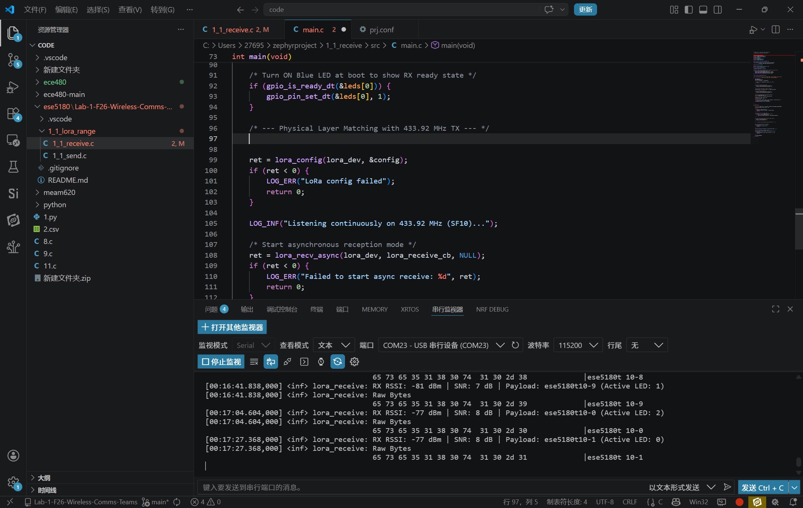
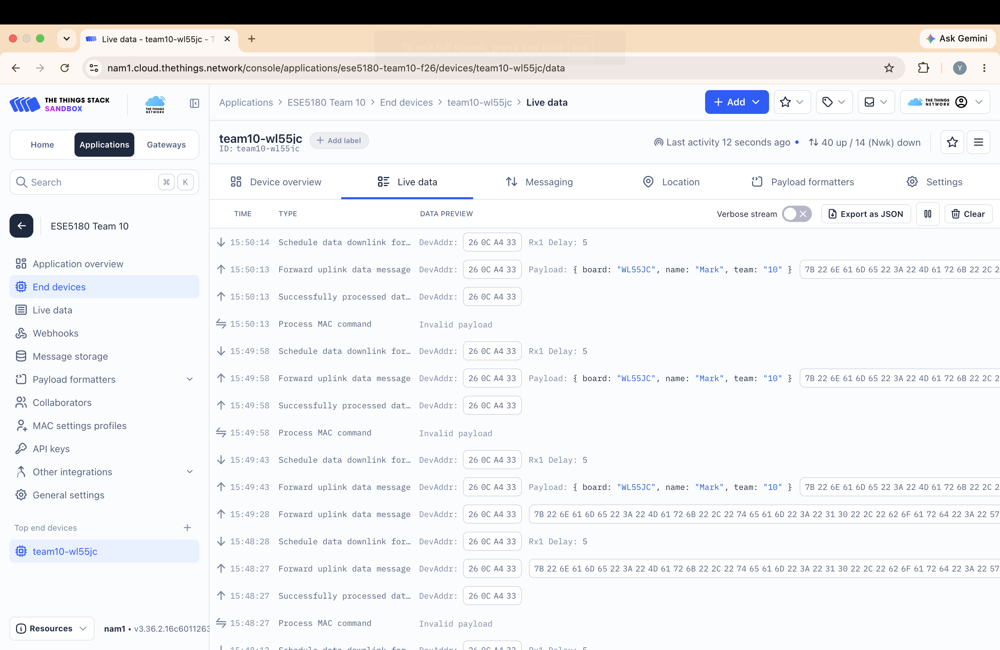
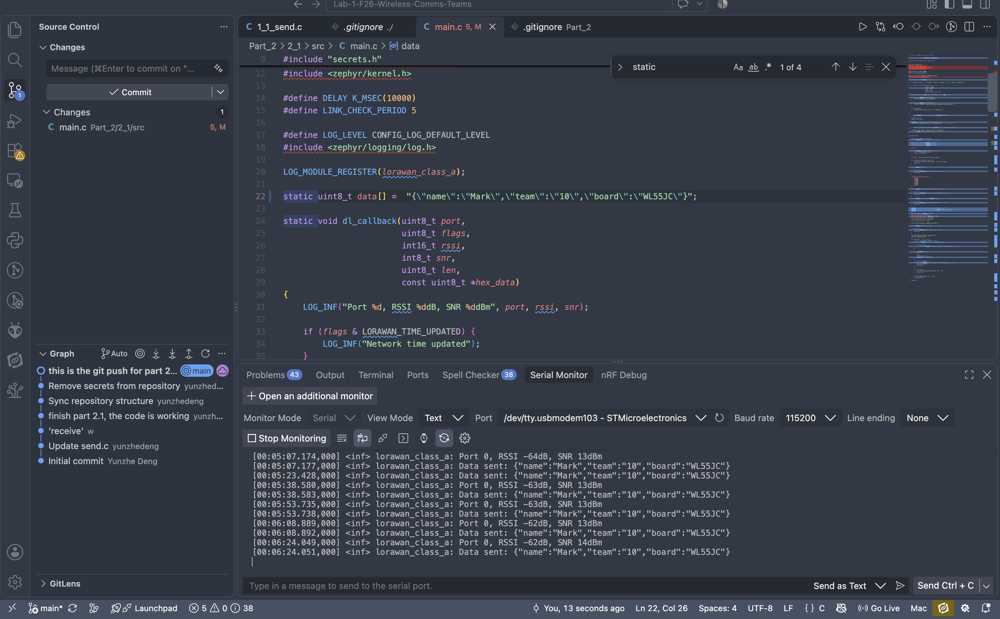

# ESE5180: Lab 1 Wireless Comms

**Group Number: 10**

| Team Member Name | Email Address                |
| ---------------- | ---------------------------- |
| Yunzhe Deng      | deng1@engineering.upenn.edu  |
| Bowen Wang       | wangbw@engineering.upenn.edu |

**GitHub Repository URL: [https://github.com/yunzhedeng/Lab-1-F26-Wireless-Comms-Teams.git](https://github.com/yunzhedeng/Lab-1-F26-Wireless-Comms-Teams.git)**

## Part 1 LoRa

### 1.1 LoRa Range Challenge

We submitted our send and receive code to github.

**RSSI: -77dBm;  SNR:8 8dB; Longest Distance: 400m**

Here is the screenshot of our longest distance:

### 1.2 Trading Range for Bandwidth

We submitted our send and receive code to github. 

The fastest transmission speed is 11ms. To maximize transmission speed, we increased the LoRa bandwidth to 500 kHz, reduced the spreading factor to SF7, used a coding rate of 4/5, and kept the preamble length at 8 symbols.

## Part 2 LoRaWAN

### 2.1

We submitted our code to github.

### 2.2

Here are the screenshots:

